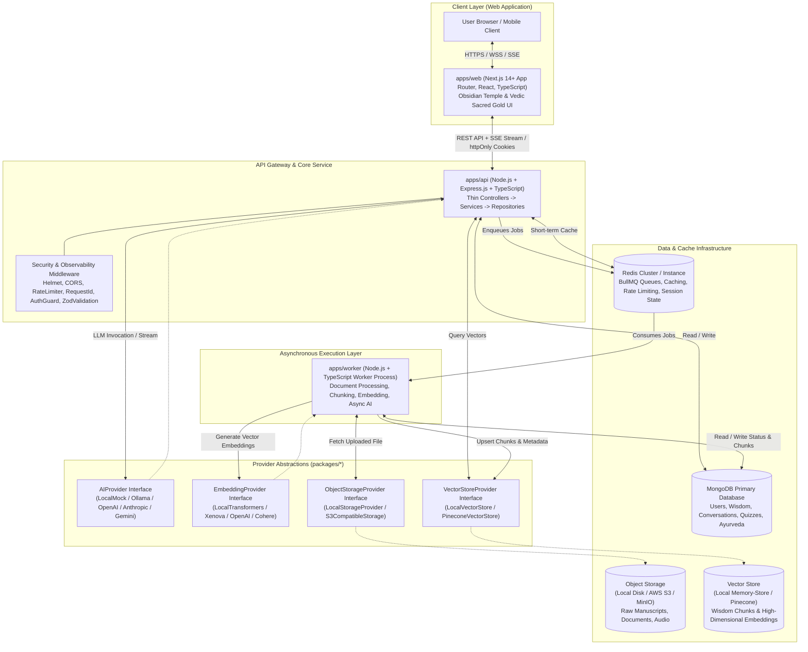
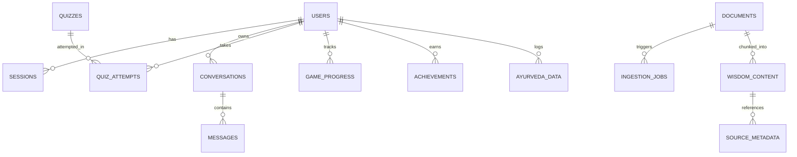
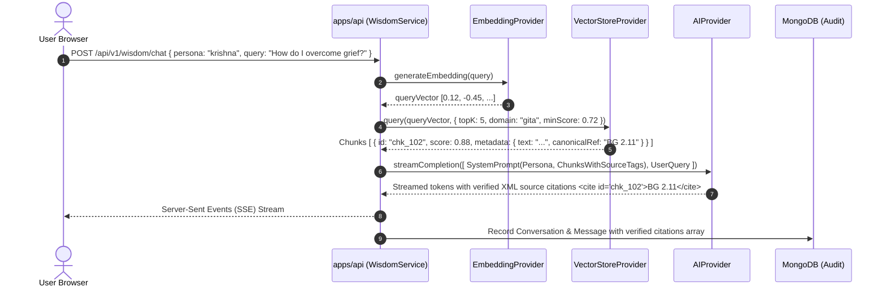
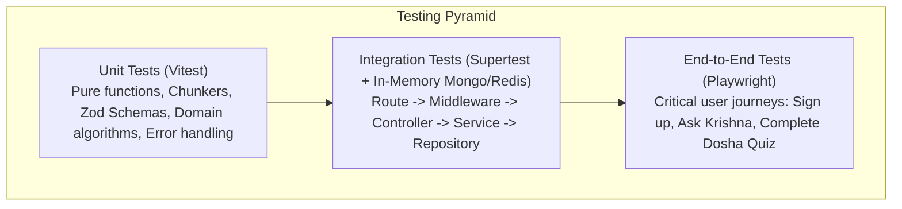
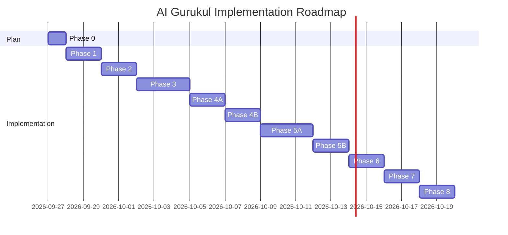

# AI Gurukul – Architecture Specification & Master Blueprint (Phase 0)

> **Document Status**: Complete Architecture Plan  
> **Target System**: AI Gurukul – Ancient Wisdom for Modern Life (Production Rebuild)  
> **Database**: MongoDB + Mongoose (Strictly No PostgreSQL / No Prisma)  
> **Application Runtime**: Monorepo with Next.js (Web), Express.js (API), and BullMQ (Worker)

---

## 1. System Architecture Diagram



---

## 2. Monorepo Structure

The monorepo uses **Turborepo** with **npm workspaces**. All internal packages are written in TypeScript with isolated builds, strict typings, and zero circular dependencies.

```text
c:/aigurukul(2.0)/
├── .github/
│   └── workflows/
│       ├── ci.yml                 # Lint, TypeCheck, Unit & Integration Tests
│       └── release.yml            # Deployment automation
├── apps/
│   ├── web/                       # Next.js App Router (Client Application)
│   │   ├── app/                   # App router pages, layouts, route handlers
│   │   │   ├── (auth)/            # Login, register, forgot-password
│   │   │   ├── (dashboard)/       # Wisdom feed, chat, ayurveda, quizzes, progress
│   │   │   ├── api/               # Next.js BFF proxy routes (if needed)
│   │   │   ├── layout.tsx         # Root layout with Obsidian Temple theme
│   │   │   └── page.tsx           # Landing page
│   │   ├── components/            # UI components (Atomic design)
│   │   │   ├── ui/                # Buttons, inputs, modals, cards
│   │   │   ├── wisdom/            # Chat stream, persona selector, citation badges
│   │   │   ├── ayurveda/          # Dosha quiz, consultation cards
│   │   │   └── gamification/      # XP bars, streak counters, badges
│   │   ├── hooks/                 # Custom React hooks (useAuth, useWisdomChat)
│   │   ├── lib/                   # Client utilities, api client
│   │   ├── styles/                # Global CSS, theme tokens
│   │   ├── public/                # Static assets, fonts, icons
│   │   ├── next.config.mjs
│   │   ├── package.json
│   │   └── tsconfig.json
│   │
│   ├── api/                       # Core Express.js Backend API
│   │   ├── src/
│   │   │   ├── controllers/       # HTTP controllers (thin layer)
│   │   │   ├── services/          # Business logic orchestration
│   │   │   ├── repositories/      # MongoDB Mongoose data-access layer
│   │   │   ├── routes/            # Express routers and endpoint definitions
│   │   │   ├── middlewares/       # Auth, rate-limit, validation, requestId, error
│   │   │   ├── app.ts             # Express app setup and middleware pipeline
│   │   │   └── server.ts          # Server entrypoint with graceful shutdown
│   │   ├── package.json
│   │   └── tsconfig.json
│   │
│   └── worker/                    # Asynchronous BullMQ Background Processor
│       ├── src/
│       │   ├── processors/        # Ingestion, embedding, translation job handlers
│       │   ├── queues/            # Queue instances & definitions
│       │   ├── services/          # Worker-specific business logic (chunkers, extractors)
│       │   └── index.ts           # Worker daemon entrypoint & shutdown hooks
│       ├── package.json
│       └── tsconfig.json
│
├── packages/
│   ├── types/                     # Shared TypeScript domain interfaces & DTOs
│   │   ├── src/
│   │   │   ├── user.ts
│   │   │   ├── wisdom.ts
│   │   │   ├── ayurveda.ts
│   │   │   ├── quiz.ts
│   │   │   ├── rag.ts
│   │   │   └── job.ts
│   │   ├── package.json
│   │   └── tsconfig.json
│   │
│   ├── validation/                # Zod schemas for system boundary validation
│   │   ├── src/
│   │   │   ├── auth.schema.ts
│   │   │   ├── wisdom.schema.ts
│   │   │   ├── document.schema.ts
│   │   │   ├── quiz.schema.ts
│   │   │   └── ayurveda.schema.ts
│   │   ├── package.json
│   │   └── tsconfig.json
│   │
│   ├── config/                    # Centralized environment variable parser (Zod)
│   │   ├── src/
│   │   │   ├── env.ts             # Strongly-typed config objects (API, Worker, Web)
│   │   │   └── constants.ts       # Global defaults, system limits
│   │   ├── package.json
│   │   └── tsconfig.json
│   │
│   ├── database/                  # Mongoose models, schemas, connection manager, migrations
│   │   ├── src/
│   │   │   ├── connection.ts      # Resilient MongoDB connection pooling
│   │   │   ├── models/            # Mongoose schemas & model exports
│   │   │   ├── migrations/        # Versioned MongoDB migration runner & scripts
│   │   │   └── seeds/             # Seed scripts (Vedic texts, quizzes, personas)
│   │   ├── package.json
│   │   └── tsconfig.json
│   │
│   ├── ai/                        # AIProvider interface and multi-provider drivers
│   │   ├── src/
│   │   │   ├── ai-provider.interface.ts
│   │   │   ├── local-ai.provider.ts
│   │   │   ├── openai-ai.provider.ts
│   │   │   ├── anthropic-ai.provider.ts
│   │   │   ├── gemini-ai.provider.ts
│   │   │   └── ai-provider.factory.ts
│   │   ├── package.json
│   │   └── tsconfig.json
│   │
│   ├── embeddings/                # EmbeddingProvider interface and implementations
│   │   ├── src/
│   │   │   ├── embedding-provider.interface.ts
│   │   │   ├── local-embedding.provider.ts
│   │   │   ├── openai-embedding.provider.ts
│   │   │   ├── cohere-embedding.provider.ts
│   │   │   └── embedding-provider.factory.ts
│   │   ├── package.json
│   │   └── tsconfig.json
│   │
│   ├── vector-store/              # VectorStoreProvider interface and implementations
│   │   ├── src/
│   │   │   ├── vector-store.interface.ts
│   │   │   ├── local-vector-store.provider.ts
│   │   │   ├── pinecone-vector-store.provider.ts
│   │   │   └── vector-store.factory.ts
│   │   ├── package.json
│   │   └── tsconfig.json
│   │
│   ├── storage/                   # ObjectStorageProvider interface and drivers
│   │   ├── src/
│   │   │   ├── object-storage.interface.ts
│   │   │   ├── local-storage.provider.ts
│   │   │   ├── s3-storage.provider.ts
│   │   │   └── storage.factory.ts
│   │   ├── package.json
│   │   └── tsconfig.json
│   │
│   └── logging/                   # Structured logging (Pino) with correlation IDs
│       ├── src/
│       │   ├── logger.ts
│       │   ├── pino-options.ts
│       │   └── http-logger.middleware.ts
│       ├── package.json
│       └── tsconfig.json
│
├── tests/                         # End-to-end integration & acceptance test suites
│   ├── e2e/
│   └── fixtures/
├── docker/
│   ├── docker-compose.yml         # Local dev infra (MongoDB, Redis, MinIO)
│   └── docker-compose.test.yml    # CI test infra
├── .gitignore
├── .npmrc
├── package.json                   # Monorepo root workspace config
├── turbo.json                     # Turbo task dependency pipeline
└── README.md
```

---

## 3. Package & Application Responsibilities

| Subsystem                   | Responsibility                                                                                               | Inbound Dependencies                  | Outbound Dependencies                                                                     |
| :-------------------------- | :----------------------------------------------------------------------------------------------------------- | :------------------------------------ | :---------------------------------------------------------------------------------------- |
| **`apps/web`**              | User Interface, SSR, interactive wisdom chats, persona dialogues, gamification dashboard, audio playback.    | User Browser                          | `@ai-gurukul/types`, `@ai-gurukul/validation`, Next.js                                    |
| **`apps/api`**              | REST endpoints, SSE streams, request validation, authentication, business orchestration, job dispatching.    | Web Frontend                          | `@ai-gurukul/*` (all packages)                                                            |
| **`apps/worker`**           | Isolated worker process executing long-running jobs (PDF parsing, chunking, embedding, vector upserts).      | BullMQ / Redis                        | `@ai-gurukul/types`, `database`, `ai`, `embeddings`, `vector-store`, `storage`, `logging` |
| **`packages/types`**        | Source of truth for all domain entities, enums, DTOs, and event payloads.                                    | All apps & packages                   | None (Pure TS)                                                                            |
| **`packages/validation`**   | Runtime data schemas (Zod). Validates client input, environment variables, job payloads.                     | `apps/web`, `apps/api`, `apps/worker` | `zod`, `@ai-gurukul/types`                                                                |
| **`packages/config`**       | Centralized, validated environment configuration via Zod. Prevents boot on invalid env.                      | `apps/api`, `apps/worker`, `apps/web` | `dotenv`, `zod`                                                                           |
| **`packages/database`**     | Mongoose connection lifecycle, schemas, migration engine, seed scripts.                                      | `apps/api`, `apps/worker`             | `mongoose`, `@ai-gurukul/config`, `@ai-gurukul/logging`                                   |
| **`packages/ai`**           | Abstract LLM provider interface (`AIProvider`) and concrete drivers (Local, OpenAI, Anthropic, Gemini).      | `apps/api`, `apps/worker`             | `@ai-gurukul/types`                                                                       |
| **`packages/embeddings`**   | Abstract text-embedding interface (`EmbeddingProvider`) and concrete drivers (Local, OpenAI, Cohere).        | `apps/worker`, `apps/api`             | `@ai-gurukul/types`                                                                       |
| **`packages/vector-store`** | Abstract vector database interface (`VectorStoreProvider`) and concrete drivers (Local In-Memory, Pinecone). | `apps/api`, `apps/worker`             | `@ai-gurukul/types`                                                                       |
| **`packages/storage`**      | Abstract file storage interface (`ObjectStorageProvider`) and drivers (Local Disk, S3/MinIO).                | `apps/api`, `apps/worker`             | `@ai-gurukul/types`                                                                       |
| **`packages/logging`**      | Universal structured logging with Pino, redaction, request ID tracking, and log levels.                      | All apps & packages                   | `pino`, `pino-http`                                                                       |

---

## 4. API Layer Architecture: Strict Separation of Concerns

```mermaid
flowchart LR
    ClientReq["Client HTTP / SSE Request"] --> Router["Express Router\n(/api/v1/...)"]
    Router --> Middleware["Middlewares\nAuthGuard, ZodValidate(Schema), RateLimiter"]
    Middleware --> Controller["Controller (Thin)\nUnpacks DTO, calls Service, sends HTTP status"]
    Controller --> Service["Service (Business Logic)\nOrchestrates algorithms, LLM streams, jobs"]
    Service --> Repository["Repository (Data Access)\nExecutes atomic Mongoose queries & aggregations"]
    Repository --> MongooseModel["Mongoose Model\nCollection mapping, validation, indexes"]
    MongooseModel --> MongoDB[(MongoDB Instance)]
```



### Layer Constraints & Rules

1. **Router**: Only attaches routes to middleware and controller methods. No logic.
2. **Controller**:
   - MUST NEVER invoke Mongoose models directly.
   - Parses validated parameters from `req.body`, `req.params`, `req.query` (typed by Zod).
   - Passes clean DTOs into the Service layer.
   - Formats API responses conforming to standard envelope `{ success: true, data: T, meta?: Record<string, any> }`.
3. **Service**:
   - Contains 100% of domain and business logic.
   - Coordinates with `Repository` for persistence.
   - Interacts with `AIProvider`, `EmbeddingProvider`, `VectorStoreProvider`, and BullMQ queues.
   - Throws domain errors (`NotFoundError`, `ValidationError`, `UnauthorizedError`, `ConflictError`).
4. **Repository**:
   - Only layer allowed to import Mongoose models.
   - Encapsulates queries, projections, pagination, and database transactions (`ClientSession`).
   - Converts Mongoose documents to plain domain entities (`toObject()` / `lean()`).

---

## 5. MongoDB Collections & Schema Design

All schemas are declared with strict TypeScript types, timestamps enabled (`timestamps: true`), strict schema validation (`strict: 'throw'`), and optimized compound indexes.



### Collection Definitions

#### 1. `users`

- **Purpose**: Identity, credentials, profile, selected persona preferences, and system role.
- **Key Fields**:
  - `_id`: ObjectId
  - `email`: String (lowercase, trimmed, unique)
  - `passwordHash`: String (bcrypt hash, nullable for OAuth-only users)
  - `displayName`: String
  - `role`: Enum (`'learner'`, `'scholar'`, `'admin'`)
  - `oauthProviders`: Array of `{ provider: 'google', providerId: String }`
  - `preferences`: `{ defaultPersona: 'krishna' | 'chanakya' | 'vaidya', language: 'en' | 'sa' | 'hi' | 'ta' }`
  - `isEmailVerified`: Boolean
  - `createdAt`, `updatedAt`: Date
- **Indexes**:
  - `{ email: 1 }` (Unique)
  - `{ 'oauthProviders.provider': 1, 'oauthProviders.providerId': 1 }` (Sparse)
- **Phase**: **Phase 2**

#### 2. `sessions`

- **Purpose**: Refresh token rotation and device-level session invalidation.
- **Key Fields**:
  - `userId`: ObjectId (Ref: `User`)
  - `refreshTokenHash`: String (SHA-256 hash of refresh token)
  - `userAgent`: String
  - `ipAddress`: String
  - `isValid`: Boolean
  - `expiresAt`: Date
  - `createdAt`, `updatedAt`: Date
- **Indexes**:
  - `{ userId: 1 }`
  - `{ refreshTokenHash: 1 }`
  - `{ expiresAt: 1 }` (TTL index for automatic purge)
- **Phase**: **Phase 2**

#### 3. `wisdom_content`

- **Purpose**: Curated verses, commentaries, stories, and historical knowledge chunks.
- **Key Fields**:
  - `domain`: Enum (`'gita'`, `'chanakya'`, `'ramayana'`, `'mahabharata'`, `'panchatantra'`, `'ayurveda'`, `'upanishads'`)
  - `canonicalReference`: String (e.g., `"BG 2.47"`, `"Arthashastra 1.7.1"`)
  - `originalText`: String (Devanagari, Grantha, or transliterated Sanskrit/Tamil/Pali)
  - `transliteration`: String (IAST format)
  - `translations`: Array of `{ language: String, text: String, author: String }`
  - `commentaries`: Array of `{ commentator: String, text: String }`
  - `themes`: Array of String (e.g., `['duty', 'action', 'stress-relief', 'leadership']`)
  - `vectorId`: String (reference to vector database point)
  - `metadata`: `{ chapter: Number, verse: Number, speaker: String }`
- **Indexes**:
  - `{ domain: 1, canonicalReference: 1 }` (Unique)
  - `{ themes: 1 }`
  - `{ vectorId: 1 }`
- **Phase**: **Phase 1 (Mock/Seed) / Phase 3**

#### 4. `conversations`

- **Purpose**: Chat session threads between a user and a chosen wisdom persona.
- **Key Fields**:
  - `userId`: ObjectId (Ref: `User`)
  - `persona`: Enum (`'krishna'`, `'chanakya'`, `'vaidya'`, `'vyasa'`, `'patanjali'`)
  - `title`: String
  - `status`: Enum (`'active'`, `'archived'`)
  - `contextSummary`: String (rolling LLM summary of old messages)
  - `createdAt`, `updatedAt`: Date
- **Indexes**:
  - `{ userId: 1, updatedAt: -1 }`
- **Phase**: **Phase 3**

#### 5. `messages`

- **Purpose**: Individual messages within a conversation, recording full RAG audit traces.
- **Key Fields**:
  - `conversationId`: ObjectId (Ref: `Conversation`)
  - `sender`: Enum (`'user'`, `'assistant'`, `'system'`)
  - `content`: String
  - `citations`: Array of `{ sourceId: ObjectId, canonicalRef: String, chunkText: String, relevanceScore: Number }`
  - `tokenUsage`: `{ promptTokens: Number, completionTokens: Number, totalTokens: Number }`
  - `feedback`: `{ rating: Number, comment: String }`
  - `createdAt`: Date
- **Indexes**:
  - `{ conversationId: 1, createdAt: 1 }`
- **Phase**: **Phase 3**

#### 6. `ayurveda_data`

- **Purpose**: User dosha profiles (Vata, Pitta, Kapha), prakriti assessment, and wellness logs.
- **Key Fields**:
  - `userId`: ObjectId (Ref: `User`)
  - `prakriti`: `{ vata: Number, pitta: Number, kapha: Number, dominantDosha: String }`
  - `vikritiLogs`: Array of `{ date: Date, symptoms: [String], imbalances: [String], notes: String }`
  - `lifestyleRecommendations`: Array of `{ category: 'diet' | 'routine' | 'herbs', recommendation: String }`
  - `updatedAt`: Date
- **Indexes**:
  - `{ userId: 1 }` (Unique)
- **Phase**: **Phase 4A**

#### 7. `quizzes`

- **Purpose**: Dynamic and curated quizzes testing understanding of classical philosophy and texts.
- **Key Fields**:
  - `title`: String
  - `domain`: String
  - `difficulty`: Enum (`'beginner'`, `'intermediate'`, `'advanced'`)
  - `questions`: Array of `{ questionText: String, options: [String], correctIndex: Number, explanation: String, sourceRef: String }`
  - `tags`: [String]
  - `isActive`: Boolean
- **Indexes**:
  - `{ domain: 1, difficulty: 1 }`
- **Phase**: **Phase 5B**

#### 8. `quiz_attempts`

- **Purpose**: Records of user quiz participation, scoring, and weak-point analysis.
- **Key Fields**:
  - `userId`: ObjectId (Ref: `User`)
  - `quizId`: ObjectId (Ref: `Quiz`)
  - `answers`: Array of `{ questionIndex: Number, selectedIndex: Number, isCorrect: Boolean }`
  - `score`: Number
  - `totalQuestions`: Number
  - `completedAt`: Date
- **Indexes**:
  - `{ userId: 1, quizId: 1, completedAt: -1 }`
- **Phase**: **Phase 5B**

#### 9. `game_progress`

- **Purpose**: Gamification engine tracking XP, Vedic levels, daily streaks, and skill trees.
- **Key Fields**:
  - `userId`: ObjectId (Ref: `User`, Unique)
  - `xp`: Number (default: 0)
  - `currentLevel`: Number (default: 1)
  - `levelTitle`: String (e.g., `'Sadhaka'`, `'Brahmachari'`, `'Pandita'`, `'Rishi'`)
  - `streak`: `{ currentCount: Number, longestCount: Number, lastActiveDate: Date }`
  - `unlockedNodes`: Array of String (Knowledge graph nodes mastered)
- **Indexes**:
  - `{ userId: 1 }` (Unique)
  - `{ xp: -1 }` (Leaderboards)
- **Phase**: **Phase 6**

#### 10. `achievements`

- **Purpose**: Badges earned through continuous learning, reading verses, or quiz mastery.
- **Key Fields**:
  - `userId`: ObjectId (Ref: `User`)
  - `badgeKey`: String (e.g., `'gita_chapter_2_master'`, `'7_day_dhyana_streak'`)
  - `title`: String
  - `description`: String
  - `iconUrl`: String
  - `unlockedAt`: Date
- **Indexes**:
  - `{ userId: 1, badgeKey: 1 }` (Unique)
- **Phase**: **Phase 6**

#### 11. `documents`

- **Purpose**: Tracks uploaded or ingested raw documents (manuscripts, PDFs, texts).
- **Key Fields**:
  - `originalFileName`: String
  - `storageKey`: String (path in ObjectStorage)
  - `mimeType`: String
  - `fileSize`: Number
  - `uploaderId`: ObjectId (Ref: `User`)
  - `status`: Enum (`'pending'`, `'processing'`, `'indexed'`, `'failed'`)
  - `error`: String
  - `metadata`: `{ domain: String, language: String, author: String, era: String }`
  - `createdAt`, `updatedAt`: Date
- **Indexes**:
  - `{ uploaderId: 1 }`
  - `{ status: 1 }`
- **Phase**: **Phase 5A**

#### 12. `ingestion_jobs`

- **Purpose**: Audit record of document processing, chunk counts, and BullMQ worker runs.
- **Key Fields**:
  - `documentId`: ObjectId (Ref: `Document`)
  - `bullJobId`: String
  - `status`: Enum (`'queued'`, `'extracting'`, `'chunking'`, `'embedding'`, `'completed'`, `'failed'`)
  - `chunksCreated`: Number
  - `processingDurationMs`: Number
  - `logs`: Array of `{ timestamp: Date, step: String, message: String }`
- **Indexes**:
  - `{ documentId: 1 }`
  - `{ bullJobId: 1 }`
- **Phase**: **Phase 5A**

#### 13. `translation_history`

- **Purpose**: Caches AI translation of verses/manuscripts across Sanskrit, Tamil, Pali, Hindi, and English.
- **Key Fields**:
  - `sourceLanguage`: String
  - `targetLanguage`: String
  - `sourceTextHash`: String (SHA-256 for exact cache hit)
  - `sourceText`: String
  - `translatedText`: String
  - `wordByWordAnalysis`: Array of `{ word: String, root: String, grammaticalRole: String, meaning: String }`
  - `createdAt`: Date
- **Indexes**:
  - `{ sourceTextHash: 1, targetLanguage: 1 }` (Unique)
- **Phase**: **Phase 7**

#### 14. `source_metadata`

- **Purpose**: Granular bibliographical tracing for all canonical texts and manuscripts.
- **Key Fields**:
  - `title`: String
  - `author`: String
  - `tradition`: String
  - `license`: String
  - `edition`: String
  - `curatorNotes`: String
- **Indexes**:
  - `{ title: 1 }`
- **Phase**: **Phase 5A**

---

## 6. MongoDB Migration & Versioning Strategy

Because MongoDB is non-relational, schema changes and index builds must be executed deterministically without manual shell scripts or SQL tooling.

### Mechanism: Custom Versioned Migration Runner (`packages/database`)

1. **Migration State Collection**: `__migrations` collection in MongoDB stores:
   ```typescript
   interface IMigrationRecord {
     id: string; // e.g. "202609270001_create_user_indexes.ts"
     appliedAt: Date;
     checksum: string;
     durationMs: number;
   }
   ```
2. **Deterministic Script Structure**:
   ```typescript
   export interface MigrationScript {
     id: string;
     up: (db: mongoose.Connection) => Promise<void>;
     down: (db: mongoose.Connection) => Promise<void>;
   }
   ```
3. **Execution Safety**:
   - Executes inside database transactions where supported (Replica Set).
   - Atomic lock acquisition using a TTL document prevents race conditions across multi-instance API deployments.
   - CLI command: `npm run db:migrate` and `npm run db:migrate:rollback`.
4. **Seed Strategy**:
   - `npm run db:seed`: Idempotent seeding using `upsert` queries keyed on canonical references (e.g. `canonicalReference: 'BG 2.47'`).
   - Separate seed datasets for `development` (rich sample verses, test personas, dosha questions) and `test` (minimal deterministic mocks).

---

## 7. Authentication & Authorization Architecture

- **Session Model**: Dual-token architecture using **HTTP-Only, Secure, SameSite=Strict Cookies**.
  - **Access Token**: Short-lived (15 minutes), signed JWT containing `{ sub: userId, role: role }`.
  - **Refresh Token**: Long-lived (7 days), cryptographically random string stored as a SHA-256 hash in the `sessions` collection with rotation on every use.
- **Password Security**: Salted hash using `bcrypt` (12 work factor rounds). Plaintext passwords never cross beyond the controller boundary unhashed.
- **Google OAuth 2.0**: Validated server-side via Google Token Verification (`google-auth-library`), creating or linking the user record in `users`.
- **RBAC**: Middleware guard (`requireRole(['admin', 'scholar'])`) inspecting the authenticated session context.
- **CSRF & Cookie Protection**:
  - Cookies configured with: `HttpOnly = true`, `Secure = (NODE_ENV === 'production')`, `SameSite = 'Strict'`, `Path = '/'`.

---

## 8. Redis Architecture

Redis acts as a high-performance memory broker for queue orchestration, transient caching, and distributed rate limiting.

### Key Namespaces & TTL Policies

| Namespace      | Key Pattern                     | TTL               | Purpose                                |
| :------------- | :------------------------------ | :---------------- | :------------------------------------- |
| **BullMQ**     | `bull:ingestion:*`, `bull:ai:*` | Managed by BullMQ | Background worker queue data and locks |
| **Rate Limit** | `rl:ip:{ipAddress}`             | 60 seconds        | Tiered request throttling per IP       |
| **Rate Limit** | `rl:user:{userId}`              | 60 seconds        | API rate limit per authenticated user  |
| **Cache**      | `cache:wisdom:{canonicalRef}`   | 24 hours          | High-frequency verse retrieval caching |
| **Cache**      | `cache:dosha:quiz`              | 7 days            | Static quiz question cache             |
| **Lock**       | `lock:migration`                | 60 seconds        | Migration execution distributed mutex  |

---

## 9. BullMQ Worker & Queue Topology

The Worker runs in an entirely separate process (`apps/worker`) from the API. The API only acts as a job producer; it never consumes or runs long-running ingestion/embedding loops.

```mermaid
flowchart LR
    subgraph ApiProcess ["apps/api (Producer)"]
        UploadEndpoint["POST /api/v1/documents/upload"]
        UploadEndpoint --> Enqueue["BullMQ Queue.add()\n'document-ingestion'"]
    end

    subgraph RedisBroker ["Redis Broker"]
        QueueDef[("Queue: document-ingestion\nQueue: embedding-generation\nQueue: manuscript-translation")]
    end

    subgraph WorkerProcess ["apps/worker (Consumer Daemon)"]
        IngestionWorker["IngestionWorker\n(Concurrency: 3, Retries: 3 with Exp Backoff)"]
        ExtractionStep["1. Stream from ObjectStorage"]
        ChunkStep["2. Semantic Chunking (500 tokens)"]
        EmbedStep["3. Generate Embeddings"]
        VectorStep["4. Upsert to VectorStoreProvider"]
        StatusStep["5. Update MongoDB Status to 'indexed'"]

        IngestionWorker --> ExtractionStep --> ChunkStep --> EmbedStep --> VectorStep --> StatusStep
    end

    Enqueue --> QueueDef
    QueueDef --> IngestionWorker
```



### Worker Configuration & Failure Handling

- **Queue Names**:
  - `document-ingestion`: Handles document extraction, chunking, and indexing.
  - `ai-heavy-jobs`: Handles long-form manuscript translation and offline quiz generation.
- **Worker Configuration**:
  - `concurrency: 3` (avoids memory starvation on PDF extraction).
  - `attempts: 3` with `backoff: { type: 'exponential', delay: 5000 }`.
  - Failed jobs are routed to BullMQ's built-in failed job set for manual or automated dead-letter inspection.
  - Graceful worker shutdown handles active jobs before termination.

---

## 10. Provider Interfaces & Abstraction Layers

All infrastructure-dependent operations are shielded behind typed interfaces, enabling 100% free/local development without changing business logic.

### 1. `AIProvider` (`packages/ai`)

```typescript
export interface AIMessage {
  role: 'system' | 'user' | 'assistant';
  content: string;
}

export interface AICompletionOptions {
  temperature?: number;
  maxTokens?: number;
  stopSequences?: string[];
  responseFormat?: 'text' | 'json';
}

export interface AIProvider {
  readonly providerName: string;
  generateCompletion(messages: AIMessage[], options?: AICompletionOptions): Promise<string>;
  streamCompletion(messages: AIMessage[], options?: AICompletionOptions): AsyncIterable<string>;
  generateStructuredOutput<T>(messages: AIMessage[], schema: unknown): Promise<T>;
}
```

_Implementations_: `LocalAIProvider` (Mock / Ollama), `AnthropicAIProvider`, `OpenAIProvider`, `GeminiAIProvider`.

### 2. `EmbeddingProvider` (`packages/embeddings`)

```typescript
export interface EmbeddingResult {
  embedding: number[];
  dimensions: number;
}

export interface EmbeddingProvider {
  readonly providerName: string;
  readonly dimensions: number;
  generateEmbedding(text: string): Promise<EmbeddingResult>;
  generateEmbeddings(texts: string[]): Promise<EmbeddingResult[]>;
}
```

_Implementations_: `LocalEmbeddingProvider` (Transformers.js / Xenova in-process 384-dim), `OpenAIEmbeddingProvider` (1536-dim), `CohereEmbeddingProvider`.

### 3. `VectorStoreProvider` (`packages/vector-store`)

```typescript
export interface VectorRecord {
  id: string;
  values: number[];
  metadata: {
    documentId: string;
    canonicalReference?: string;
    domain: string;
    chunkText: string;
    chapter?: number;
    verse?: number;
    [key: string]: unknown;
  };
}

export interface VectorQueryOptions {
  topK: number;
  filter?: Record<string, unknown>;
  minScore?: number;
}

export interface VectorQueryResult {
  id: string;
  score: number;
  metadata: VectorRecord['metadata'];
}

export interface VectorStoreProvider {
  readonly providerName: string;
  upsert(records: VectorRecord[]): Promise<void>;
  query(vector: number[], options: VectorQueryOptions): Promise<VectorQueryResult[]>;
  delete(ids: string[]): Promise<void>;
  deleteByFilter(filter: Record<string, unknown>): Promise<void>;
}
```

_Implementations_: `LocalVectorStoreProvider` (Cosine similarity in-memory with file persistence), `PineconeVectorStoreProvider`.

### 4. `ObjectStorageProvider` (`packages/storage`)

```typescript
import { Readable } from 'node:stream';

export interface UploadOptions {
  contentType: string;
  metadata?: Record<string, string>;
}

export interface ObjectStorageProvider {
  readonly providerName: string;
  upload(key: string, data: Buffer | Readable, options: UploadOptions): Promise<string>;
  downloadStream(key: string): Promise<Readable>;
  getSignedUrl(key: string, expiresInSeconds: number): Promise<string>;
  delete(key: string): Promise<void>;
}
```

_Implementations_: `LocalStorageProvider` (writes to `.storage/` on local disk), `S3CompatibleStorageProvider` (AWS S3 / Cloudflare R2 / MinIO).

---

## 11. RAG Data Flow & Source Citation Traceability



### Traceability Guarantee

Every response chunk returned by the vector store contains:

- `documentId`: Original file or canonical compilation.
- `chunkId`: Unique ID of the indexed text snippet.
- `canonicalReference`: Chapter and verse (e.g. `BG 2.47`).
- `relevanceScore`: Distance score computed during vector search.

The AI system prompt enforces that any factual claim must be wrapped in citation tags referencing these specific chunk IDs. A response parsing pipeline validates that no citation exists in the generated text that was not present in the retrieved chunks.

---

## 12. Observability, Logging & Error Taxonomy

### 1. Structured Logging (`packages/logging`)

- Built on **Pino** outputting strict JSON in production, with `pino-pretty` enabled only in development.
- Automatically captures: `requestId`, `timestamp`, `level`, `environment`, `userId` (when authenticated), `durationMs`, and `errorStack`.

### 2. Request & Correlation ID

- Middleware assigns or propagates `X-Request-ID` on all incoming HTTP requests.
- The ID is injected into:
  - Express `res.setHeader('X-Request-ID', reqId)`
  - Pino child logger instance attached to `req.log`
  - Job metadata when enqueuing BullMQ background tasks (`correlationId`)

### 3. Health & Readiness Endpoints

- `/health/live`: Returns `200 OK` if the process is up.
- `/health/ready`: Performs live ping checks against:
  - MongoDB (`mongoose.connection.readyState === 1`)
  - Redis (`redis.ping() === 'PONG'`)
  - Vector Store (provider ping)
  - Returns `503 Service Unavailable` with details if any critical dependency is offline.

### 4. Graceful Shutdown

- Catches `SIGTERM` and `SIGINT`.
- Stops accepting new HTTP connections via `server.close()`.
- BullMQ workers pause and finish in-flight jobs (`worker.close()`).
- Mongoose connection closed cleanly (`mongoose.disconnect()`).
- Redis client disconnected (`redis.quit()`).

### 5. Domain Error Taxonomy

```text
AppError (Base class)
├── BadRequestError (400)
├── ValidationError (422) [With Zod field errors]
├── UnauthorizedError (401)
├── ForbiddenError (403)
├── NotFoundError (404)
├── ConflictError (409)
├── RateLimitExceededError (429)
└── InternalServerError (500)
```

---

## 13. Testing Strategy

Testing is integrated into every phase. Code without tests is not accepted.



- **Unit Testing**: Vitest across all `packages/*` and `apps/*`. Fast, isolated, fully mocked.
- **Integration Testing**: Supertest against Express routes. Runs against `mongodb-memory-server` and in-memory Redis or Docker services.
- **E2E Testing**: Playwright running against the Next.js frontend hitting the API server with seeded test data.

---

## 14. Local vs. Production Infrastructure

| Resource            | Local Development (Free / Zero-Cost)              | Production Infrastructure               |
| :------------------ | :------------------------------------------------ | :-------------------------------------- |
| **Monorepo Runner** | Turborepo + npm workspaces                        | Turborepo Remote Caching                |
| **MongoDB**         | Dockerized MongoDB 7.0 or Local Mongo             | MongoDB Atlas Dedicated Cluster (M10+)  |
| **Redis**           | Dockerized Redis 7 Alpine                         | AWS ElastiCache / Redis Cloud / Upstash |
| **Object Storage**  | `LocalStorageProvider` (`.storage/`)              | AWS S3 / Cloudflare R2                  |
| **Vector Store**    | `LocalVectorStoreProvider` (In-memory + Cosine)   | Pinecone Vector Database (Serverless)   |
| **AI LLM**          | `LocalAIProvider` (Mock / Ollama / Gemini Free)   | Anthropic Claude 3.5 / OpenAI GPT-4o    |
| **Embeddings**      | `LocalEmbeddingProvider` (Transformers.js / 384d) | OpenAI `text-embedding-3-small`         |
| **Web Hosting**     | `localhost:3000`                                  | Vercel / Cloudflare Pages               |
| **API & Worker**    | `localhost:5000` & `localhost:5001`               | AWS ECS / Render / Fly.io Containerized |

---

## 15. Environment Variables & Configuration Schema

All configurations are strictly validated at startup using Zod in `@ai-gurukul/config`.

```typescript
// packages/config/src/env.ts schema outline
export const ApiEnvSchema = z.object({
  NODE_ENV: z.enum(['development', 'test', 'production']).default('development'),
  PORT: z.coerce.number().default(5000),
  CORS_ORIGIN: z.string().default('http://localhost:3000'),
  MONGODB_URI: z.string().url(),
  REDIS_URL: z.string().url(),
  JWT_ACCESS_SECRET: z.string().min(32),
  JWT_REFRESH_SECRET: z.string().min(32),
  COOKIE_SECRET: z.string().min(32),
  AI_PROVIDER: z.enum(['local', 'openai', 'anthropic', 'gemini']).default('local'),
  EMBEDDING_PROVIDER: z.enum(['local', 'openai', 'cohere']).default('local'),
  VECTOR_STORE_PROVIDER: z.enum(['local', 'pinecone']).default('local'),
  STORAGE_PROVIDER: z.enum(['local', 's3']).default('local'),
  // Optional Provider Keys (Validated conditionally)
  OPENAI_API_KEY: z.string().optional(),
  ANTHROPIC_API_KEY: z.string().optional(),
  GEMINI_API_KEY: z.string().optional(),
  PINECONE_API_KEY: z.string().optional(),
  PINECONE_INDEX: z.string().optional(),
  AWS_S3_BUCKET: z.string().optional(),
});
```

---

## 16. Security Architecture

1. **Input Validation**: 100% of input parameters validated via Zod schemas at route boundaries.
2. **Authentication Security**:
   - `bcrypt` hashing with salt rounds = 12.
   - Refresh token rotation with SHA-256 storage.
   - HttpOnly, SameSite=Strict cookies to eliminate XSS token theft.
3. **HTTP Hardening**:
   - `helmet()` enabled with strict Content Security Policy (CSP).
   - Strict CORS whitelist allowing only the verified frontend origin.
4. **Rate Limiting**:
   - Global rate limiter (100 req/min per IP) via Redis store.
   - Sensitive route limiters (e.g. `/auth/login`: 5 req/min per IP).
5. **File Upload Security**:
   - Magic-byte verification (rejecting executable files masquerading as PDFs/images).
   - Strict size caps (e.g. 15MB for documents).
   - Files stored with non-guessable UUID keys, never executed on server.
6. **Information Disclosure Prevention**:
   - Stack traces stripped in all non-development environments.
   - Standard error response format with no database internals exposed.

---

## 17. Frontend Design System: Obsidian Temple + Vedic Sacred Gold

- **Color Tokens**:
  - Background: `#0D0B08` (Deep Temple Obsidian)
  - Surface: `#211D12` (Sanctum Stone)
  - Secondary Surface: `#2A2515` (Carved Wood)
  - Primary Text: `#EDE8D5` (Aged Vellum Parchment)
  - Muted Text: `#9A9078` (Temple Dust)
  - Gold Accent: `#D4AF37` (Vedic Sacred Gold)
  - Gold Light: `#F2D675` (Dipta Radiance)
  - Gold Dim: `#8B6914` (Antique Gold)
- **Persona Accents**:
  - Krishna (Transcendent Compassion): `#7B68EE`
  - Chanakya (Strategic Pragmatism): `#C46B3A`
  - Guru / Vaidya (Holistic Balance): `#3A9B8C`
- **Typography**:
  - Headings: _Cinzel_ / _Plus Jakarta Sans_ (Majestic, classical serif)
  - Body: _Outfit_ / _Inter_ (Crisp, modern, readable sans-serif)
  - Sanskrit Verses: _Sanskrit 2003_ / _Noto Sans Devanagari_

---

## 18. Phase-by-Phase Implementation Roadmap

Each phase is strictly gated. A phase cannot commence until the previous phase's exit criteria and test suites pass.



### Phase Breakdown & Gating

- **PHASE 0**: Architecture Planning (Current — STOP & Review).
- **PHASE 1**: Monorepo setup, Turborepo, packages (`types`, `config`, `logging`, `database`), Express API skeleton, BullMQ worker skeleton, Health/Readiness checks, Docker compose dev infra, Vitest setup.
- **PHASE 2**: User collection, sessions, Auth repository/service/controller, bcrypt, JWT + HttpOnly cookies, Google OAuth, Zod validation, auth integration tests.
- **PHASE 3**: `AIProvider` factory, Persona prompts (Krishna, Chanakya, Vaidya), SSE streaming chat endpoint, Conversation/Message repository, Obsidian Temple Web chat interface.
- **PHASE 4A**: Ayurveda Prakriti/Vikriti assessment schemas, dosha recommendation engine, consultation UI.
- **PHASE 4B**: Knowledge graph data structures, conceptual entity nodes & edges, interactive visual graph exploration in frontend.
- **PHASE 5A**: `ObjectStorageProvider`, `EmbeddingProvider`, `VectorStoreProvider`, BullMQ ingestion worker, PDF/Text chunker, citation verification pipeline.
- **PHASE 5B**: Dynamic quiz generation, scoring engine, quiz attempt tracking, quiz UI.
- **PHASE 6**: Gamification engine, XP, streaks, Vedic learning levels (`Sadhaka` -> `Rishi`), achievements, dashboard leaderboard.
- **PHASE 7**: Sanskrit / Tamil / Pali translation engine, morphological word-by-word parser, multilingual interface.
- **PHASE 8**: Rate limiting, security headers audit, Docker production builds, E2E Playwright suite, documentation.

---

## 19. Confirmation & Next Step

Phase 0 is complete. No application code has been written yet. We are awaiting your review and approval of this architecture before proceeding to **Phase 1: Foundation + Architecture + Observability + Testing**.
